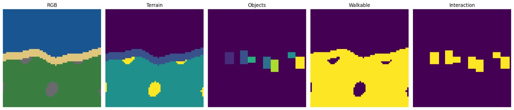

# PixelWorld 0.6 – Referenzlauf

## Konfiguration

- 12.000 synthetische Landschaften
- Batchgröße 128
- 45 Epochen
- getrennte Terrain-, Geometry-, Presence- und Attribute Encoder
- absolute X/Y-Positionen für Object Slots

## Endergebnis

| Metrik | Wert |
|---|---:|
| Terrain Mean IoU | 0,970 |
| Biome Accuracy | 1,000 |
| Orientation Accuracy | 1,000 |
| Terrain Parameter-MAE | 0,144 px |
| Presence Accuracy | 0,983 |
| Position-MAE | 1,953 px |
| Klassen-Accuracy | 0,937 |
| Aktions-Accuracy | 0,928 |
| Trigger-Accuracy | 0,935 |
| Interaction IoU | 0,470 |
| deterministische Übergänge | 1.920/1.920 |



## Trainingsbeobachtung

Terrain und Attribute konvergieren zuverlässig. Der Terrain-Loss fällt von `5,267` auf etwa `1,5` und erreicht damit nahezu sein durch die Soft Targets bestimmtes Minimum. Presence, Klasse, Aktion und Trigger werden ebenfalls stabil gelernt.

Der Positions-Loss fällt zwar von `3,654` auf `2,138`, stagniert aber deutlich oberhalb der früheren relativen Innenraumdarstellung. Ursache ist die absolute Position nach nachträglicher Wasser- und Kollisionskorrektur. Diese diskontinuierliche Zielabbildung führt trotz korrekter Slotbedeutung zu einem Positions-MAE von `1,953 Pixeln` und begrenzt die Interaction IoU auf `0,470`.

## Schlussfolgerung

0.6 bestätigt den parametrischen Terrain Graph als Repräsentation für Außenwelten. Die Resultate begründen den Architekturwechsel in 0.6.1:

```text
absolute X/Y-Position
        ↓
Terrainregion + kanonischer Anchor
```

Die vollständige Trainingskurve steht in [`training.csv`](training.csv).
